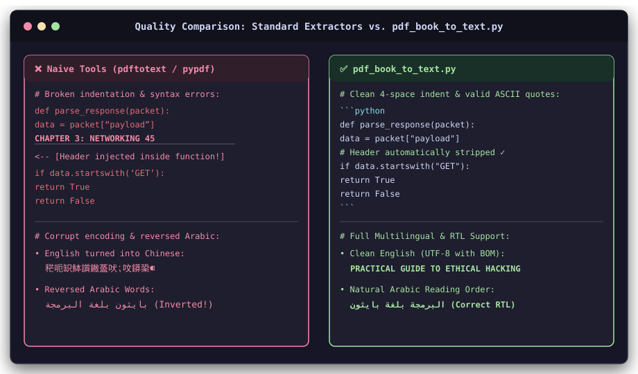
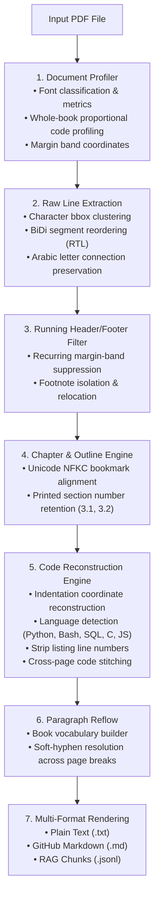

<div align="center">

# 📖 PDF Book to Text Extractor v2.0

**Extract clean, publication-grade Plain Text, GitHub Markdown, and RAG JSONL chunks from PDF books — specially tuned for programming and technical literature.**

[](https://www.python.org/downloads/)
[](LICENSE)
[](#installation)
[](tests/)
[](#contributing)

[Quick Start](#-quick-start) • [The Solution](#-the-problem-vs-the-solution) • [CLI Reference](#-cli-options-reference) • [Recipes](#-common-recipes) • [Architecture](#-architecture) • [Full Guide](GUIDE.md)

</div>

---

## ⚡ The Problem vs. The Solution

Standard PDF extraction tools (`pdftotext`, `pypdf`, `pdfplumber`) treat technical books like simple plain text documents. This breaks code listings, loses indentation, injects running headers into the middle of functions, corrupts directory tree characters, and destroys chapter hierarchies.

<p align="center">
  
</p>

### ❌ Standard Tool Output (`pdftotext` / naive extractors):
```python
# - Indentation is lost or scrambled
# - Running header injected right into the function!
# - Curly quotes break Python syntax
# - Directory tree lines corrupt into '%'

def calculate_wholesale(copies):
 wholesale_price = 24.95 * 0.60
Chapter 3. Functions 19
 shipping = 3.0 + 0.75 * (copies - 1)
 return wholesale_price * copies + shipping

print(‘Total cost:’, calculate_wholesale(60))
```

### ✅ `pdf-book-to-text` Output (v2.0):
```python
# - Automatic language-tagged code block (```python)
# - Exact 4-space indentation and alignment preserved
# - Running headers & footers automatically stripped
# - Curly quotes normalized to valid ASCII syntax
# - Box-drawing characters (├──, └──) kept 100% intact

def calculate_wholesale(copies):
    wholesale_price = 24.95 * 0.60
    shipping = 3.0 + 0.75 * (copies - 1)
    return wholesale_price * copies + shipping

print('Total cost:', calculate_wholesale(60))
```

---

## ✨ Features

* **Multi-Format Export**:
  * **Plain Text (`.txt`)**: Underlined chapter headings (`====`, `----`, `~~~~`), preserved indentation, and ASCII tables.
  * **GitHub Markdown (`.md`)**: Proper `#` heading hierarchy, fenced code blocks with detected language tags (```` ```python ````, ```` ```bash ````, ```` ```sql ````), and GFM tables.
  * **RAG JSONL (`.jsonl`)**: Structured chunk stream with book metadata, chapter/section hierarchy, page numbers, element types, and token estimates ready for vector databases (Chroma, Qdrant, Milvus, LangChain, LlamaIndex).
* **Authoritative Chapter Hierarchy**: Uses PDF bookmarks (Table of Contents) as ground truth, retaining printed section numbering (`3.1 Function calls`, `3.2 Math functions`) that typical outline parsers drop.
* **Dual-Tier Monospace & Code Detection**:
  * Regex matching for popular monospace families (`Courier`, `Consolas`, `JetBrains Mono`, `Fira Code`, `M+`, `DejaVu`, etc.).
  * **Mathematical character-metric analysis**: Measures Latin glyph width variance. If character advances are uniform across diverse letters (`'i'` vs `'m'`), it is classified as code—detecting custom/renamed fonts with 100% accuracy.
  * **Proportional Font Code Detection**: Detects code snippets even when printed in proportional body fonts (e.g. 13pt Garamond in *Python Hacking Essentials*) using statistical style-frequency profiling and syntax pattern scoring.
* **Code Listing Line Number Stripping**: Automatically detects and strips printed listing line numbers (`1  import os`) while preserving code indentation.
* **Clean Text & Box-Drawing Integrity**: Preserves box-drawing tree characters (`├──`, `└──`, `│`, `─` U+2500) and HTML entities (`&lt;div&gt;`) without corruption.
* **Full Multilingual & Arabic (RTL) Support**: Native Right-to-Left (RTL) reading order, correct BiDi span sorting, proper sentence punctuation placement, connected Arabic letter preservation, and Unicode NFKC outline matching for Arabic, Hebrew, Urdu, and Cyrillic.
* **Margin Band Header/Footer Removal**: Detects recurring top and bottom margin coordinates across hundreds of pages, removing page numbers and alternating chapter headers without losing text.
* **Footnote Relocation**: Identifies small bottom-of-page notes and relocates them to section ends, preventing them from corrupting sentence reflow across page boundaries.
* **High Performance Parallel Batch**: Multi-core extraction (`-j N`) with `--skip-existing` caching for processing large libraries.

---

## 🚀 Quick Start

### 1. Installation

```bash
# Clone the repository
git clone https://github.com/7AZZANI/pdf-book-to-text.git
cd pdf-book-to-text

# Create and activate a virtual environment
python3 -m venv .venv
source .venv/bin/activate  # On Windows: .venv\Scripts\activate

# Install the package and dependencies
pip install -e .
```

### 2. Basic Usage

Extract any PDF book into a `.txt` file:
```bash
pdf-book-to-text book.pdf
# Output: book.txt next to the PDF
```

Extract to **GitHub-Flavored Markdown** with tagged code blocks:
```bash
pdf-book-to-text book.pdf --format md
# Output: book.md
```

Extract to **RAG JSONL Chunks** for vector search and LLMs:
```bash
pdf-book-to-text book.pdf --format jsonl
# Output: book.jsonl
```

Or run interactively (prompts for file or folder):
```bash
pdf-book-to-text
```

---

## 🛠️ Common Recipes

### 📚 Recipe 1: Split into Chapter Files (for Obsidian, Notion, or e-Readers)
Creates the main file plus a `<book>_chapters/` folder with individual chapter files:
```bash
pdf-book-to-text book.pdf --format md --split-chapters
```
```text
book_chapters/
  ├── 00_frontmatter.md
  ├── 01_preface.md
  ├── 02_chapter_1_network_reconnaissance.md
  ├── 03_chapter_2_socket_programming.md
  └── ...
```

### 🤖 Recipe 2: Vector Search & RAG Embeddings (JSONL)
Extracts structured chunks with chapter path and page metadata:
```bash
pdf-book-to-text book.pdf --format jsonl -o knowledge_base.jsonl
```

Example JSONL record:
```json
{
  "id": "book_00142",
  "book": "Python for Offensive PenTest",
  "type": "code",
  "language": "python",
  "text": "import socket\ns = socket.socket(socket.AF_INET, socket.SOCK_STREAM)",
  "chapter": "Warming up – Your First Shell",
  "section": "TCP reverse shell",
  "char_count": 84,
  "token_estimate": 14
}
```

### 📁 Recipe 3: High-Speed Parallel Batch Conversion
Recursively process an entire library across 4 CPU cores, skipping previously converted books:
```bash
pdf-book-to-text ~/Books/ -r -j 4 --format md -o ~/MarkdownBooks/ --skip-existing
```

### 📑 Recipe 4: Extract Specific Page Ranges
Test a sample range or extract specific chapters:
```bash
pdf-book-to-text book.pdf --pages 10-50,85,120-140 --format md
```

### 🖼️ Recipe 5: Scanned PDFs (OCR Fallback)
Extract text from scanned pages using Tesseract:
```bash
pdf-book-to-text scanned_book.pdf --ocr --ocr-lang eng
```

---

## 📖 CLI Options Reference

| Flag | Default | Description |
| :--- | :---: | :--- |
| `inputs` | *Interactive* | PDF file(s) or directory paths to process. |
| `-o`, `--output` | `<name>.<ext>` | Destination output file or folder. Subdirectories are preserved in batch mode. |
| `-f`, `--format` | `txt` | Output format: `txt` (plain text), `md` (Markdown with ```` ```lang ````), `jsonl` (RAG chunks). |
| `-j`, `--jobs` | `1` | Number of parallel worker processes for batch extraction. |
| `--skip-existing` | `False` | Skip files that already have target output. |
| `-r`, `--recursive` | `False` | Recursively scan folders for `.pdf` files. |
| `-w`, `--width` | `100` | Paragraph wrap width (`0` = no wrap; code is never wrapped). |
| `--code-style` | `fence` | Code block format in plain text: `fence` (```` ``` ````), `indent` (4 spaces), or `plain`. |
| `--no-detect-lang` | `False` | Disable automatic programming language detection for code fences. |
| `--no-strip-line-numbers` | `False` | Do not strip leading listing line numbers from code blocks. |
| `--footnotes` | `section` | Footnote handling: `section` (append at end), `inline` (`[^N]`), or `drop`. |
| `--no-bom` | `False` | Write UTF-8 without BOM (recommended for Unix pipelines). |
| `--stdout` | `False` | Output text directly to standard output. |
| `--split-chapters` | `False` | Also outputs individual files per chapter into `<name>_chapters/`. |
| `--pages` | *All* | Page range filter (e.g. `1-20`, `35-50,75`). |
| `--page-markers` | `False` | Inserts `[Page N]` indicators to locate source pages. |
| `--no-contents` | `False` | Omits the Table of Contents block from the document header. |
| `--contents-depth` | `3` | Maximum outline depth for the generated Table of Contents header. |
| `--keep-headers` | `False` | Disables header, footer, and page number removal. |
| `--columns` | `auto` | Column layout: `auto`, `1` (single column), or `2` (two column). |
| `--tables` | `False` | Detects grid tables and formats them as ASCII or Markdown tables. |
| `--figures` | `False` | Inserts `[Figure]` placeholders where images appear. |
| `--ocr` | `False` | OCRs image-only pages (requires Tesseract). |
| `--ocr-lang` | `eng` | Tesseract language code (e.g., `eng`, `ara`, `eng+deu`). |
| `--password` | `None` | Password for encrypted PDF files. |
| `--mark-inline-code` | `False` | Wraps inline monospace code snippets in `` `backticks` ``. |
| `-q`, `--quiet` | `False` | Suppresses progress output. |

---

## 🏗️ Architecture


```mermaid
flowchart TD
    A["Input PDF File"] --> B["1. Document Profiler\n• Font classification & metrics\n• Whole-book proportional code profiling\n• Margin band coordinates"]
    B --> C["2. Raw Line Extraction\n• Character bbox clustering\n• BiDi segment reordering (RTL)\n• Arabic letter connection preservation"]
    C --> D["3. Running Header/Footer Filter\n• Recurring margin-band suppression\n• Footnote isolation & relocation"]
    D --> E["4. Chapter & Outline Engine\n• Unicode NFKC bookmark alignment\n• Printed section number retention (3.1, 3.2)"]
    E --> F["5. Code Reconstruction Engine\n• Indentation coordinate reconstruction\n• Language detection (Python, Bash, SQL, C, JS)\n• Strip listing line numbers\n• Cross-page code stitching"]
    F --> G["6. Paragraph Reflow\n• Book vocabulary builder\n• Soft-hyphen resolution across page breaks"]
    G --> H["7. Multi-Format Rendering\n• Plain Text (.txt)\n• GitHub Markdown (.md)\n• RAG Chunks (.jsonl)"]
```

---

## 🧪 Testing

The test suite runs automatically with `pytest`:

```bash
pytest tests/test_extractor.py -v
```

Tests cover:
* Box-drawing character preservation (`├──`, `└──`, `│`, `─` ord 0x2500).
* HTML entity preservation in code listings (`&lt;div&gt;`).
* Byte-swap repair on corrupt PDF bookmarks.
* Multilingual and Arabic Unicode NFKC bookmark matching.
* Programming language heuristics (Python, Bash, SQL, JSON, C).
* Code listing line-number stripping.
* Synthetic in-memory PDF extraction across TXT, MD, and JSONL formats.
* Arabic BiDi punctuation and letter joining.
* Footnote extraction and table rendering.

---

## 🤝 Contributing

Contributions, bug reports, and suggestions are welcome!
1. Fork the repository
2. Create your feature branch (`git checkout -b feature/amazing-feature`)
3. Commit your changes (`git commit -m 'Add amazing feature'`)
4. Push to the branch (`git push origin feature/amazing-feature`)
5. Open a Pull Request

---

## 📄 License & Commercial Inquiries

Copyright (c) 2026 **AZZANI**. All rights reserved.

* **Free Non-Commercial Use**: This software is free for personal use, education, research, and non-commercial open-source projects under the [AZZANI Non-Commercial Dual License](LICENSE).
* **Commercial Use**: Any use in commercial products, proprietary software, SaaS platforms, closed-source systems, or for-profit workflows requires a separate commercial license agreement.
* **Commercial Licensing Inquiries**:
  * 📧 Email: [info@7azzani.com](mailto:info@7azzani.com) / [agz97agz97@gmail.com](mailto:agz97agz97@gmail.com)
  * 🐙 GitHub: [@7AZZANI](https://github.com/7AZZANI)

See the full [`LICENSE`](LICENSE) for complete legal terms.
